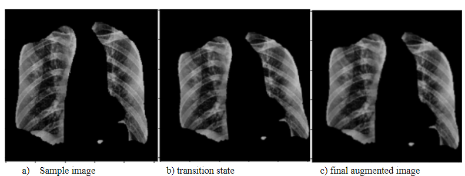

# COVID-19_Detection
This Repository consists if works related to the detection of COVID-19 and related disease from Chest Radiographs by using Image Processing Techniques, Computer Vision and Machine Learning methods.

______________________________________________________________________________________________________________________________________________________________________________

**COVID 19 Detection from radiograph using Computer Vision Deep Learning**

**Abstract- In this global pandemic situation of Covid-19, it is of foremost priority to look up for efficient and faster diagnosis methods for reducing the transmission rate of the virus SARS-Cov-2. Recent research has indicated that radiological images carry important information about the COVID-19 virus. Therefore, artificial intelligence (AI) assisted automated detection of lung infections using X-Ray images may serve as a potential diagnostic tool and can be augmented with conventional medical tests for tackling COVID-19. In this paper, we propose a new method for the detection of Covid-19 using chest X-Ray images. The proposed method can be described as a two step process. The first step includes the segmentation of the raw X-Ray images using Conditional-GAN model. In the second step we feed the segmented lung images into a novel pipeline combining hand crafted CV features and pre-trained deep neural network (DNN) models for multiclass classification of Covid-19, pneumonia, and normal chest X-Ray images. Finally, a comparative analysis of the classification performance is carried out among the considered DNN architectures. We have achieved highest testing classification accuracy of 95\% using VGG-19 model associated with BRISK CV algorithm.**

_ **Keywords:** _ _Covid-19, Image segmentation, Deep learning, Transfer learning, Classification._

1. **INTRODUCTION**

COVID-19 is an ongoing global epidemic for the last one year. COVID-19 caused by severe acute respiratory syndrome coronavirus 2 (SARS-CoV-2). There are 61.9 million confirmed cases worldwide and still rapidly increasing, from which 39.6 million people successfully recovered and 1.45 million people lost their life due to this disease as on 28th november 2020.

COVID-19 is a respiratory disease which spreads when a person gets close contact to an infected person. The virus can spread from the infected person&#39;s mouth or nose in the form of respiratory droplets when they cough, sneeze, speak and other person can catch virus when the virus gets into their mouth, nose or eyes, when they are in direct or close contact.

The reason behind the spike increase in the confirmed cases is we are not efficient at diagnosis of COVID-19. We are not able to immediately identify whether a person is infected or not. Currently for COVID-19 diagnosis reverse transcription polymerase chain reaction (RT-PCR) has been considered the gold standard, which requires specific environment and equipment for testing purposes which make it expensive. it is not easy to create a special environment everywhere and we have a limited supply of equipment. So there is a need of transportation of samples to a particular lab, which consumes a lot of time. In addition, the preparation of samples and poor quality control techniques lead to increase in false-negative rates. There is a need to adopt some alternative to reduce costs and time.

Since this virus causes infections in lungs so detection can be done using radiographic techniques. Interpretation of chest X-rays or CT-scan using Deep Learning techniques can be done for finding the visuals of COVID-19 infections and this will also help us to identify how much infections in the lungs have taken place. We can see this as a best alternative as the place of our conventional diagnosis (RT-PCR) method because of the availability of X-Ray and CT-scan machines even in rural areas. which can provide tests at affordable cost with instant results.

Most of cases radiologists go through the visual inspection which is a time consuming process and lack of prior knowledge may lead to inaccurate results. We are getting a large number of cases daily So there is a strong need to generate some automated methods to obtain a faster and accurate COVID-19 diagnosis.

Earlier works have shown Detection of COVID-19 from Chest X-Ray Images Using Convolutional Neural Networks**[15]**.Detection of COVID-19 from chest X-ray images is of vital importance for both doctors and patients to decrease the diagnostic time and reduce financial costs. Artificial intelligence and deep learning are capable of recognizing images for the tasks taught. In this study, several experiments were performed for the high-accuracy detection of COVID-19 in chest X-ray images using ConvNets. Various groups—COVID-19/Normal, COVID-19/Pneumonia, and COVID-19/Pneumonia/Normal—were considered for the classification. Different image dimensions, different network architectures, state-of-the-art pre-trained networks, and machine learning models were implemented and evaluated using images and statistical data. When the number of images in the database and the detection time of COVID-19 (average testing time = 0.03 s/image) are considered using ConvNets, it can be suggested that the considered architectures reduce the computational cost with high performance. The results showed that the convolutional neural network with minimized convolutional and fully connected layers is capable of detecting COVID-19 images within the two-class, COVID-19/Normal and COVID-19/Pneumonia classifications, with mean ROC AUC scores of 96.51 and 96.33%, respectively. In addition, the second proposed architecture, which had the second-lightest architecture, is capable of detecting COVID-19 in three-class, COVID-19/Pneumonia/Normal images, with a macro-averaged F1 score of 94.10%. Therefore, the use of AI-based automated high-accuracy technologies may provide valuable assistance to doctors in diagnosing COVID-19. Further studies, based on the results obtained in this study, would provide more information about the use of CNN architectures with COVID-19 chest X-ray images and improve on the results of this study.

We are working on an artificial-intelligence technique based on computer vision Deep Learning to detect COVID-19 patients using real-world datasets. Our system examines chest X-ray images to identify such patients. Our findings indicate that such an analysis is valuable in COVID-19 diagnosis as X-rays are conveniently available quickly and at low costs.

Now in this paper we have taken the training dataset from the sources and related description as follows:

Dataset covid-19 --\&gt; (930 images) **[1]**

Dataset Normal and Pneumonia --\&gt; (Normal --\&gt; 1585 Images and Pneumonia --\&gt; 4275 Images) **[2]**

Dataset Segmentation → (total images 247 and after augmentation 988 images i.e. 4 times increase in dataset by flipping and mirroring the images) **[3]**.

Once the dataset is downloaded and the masking model is trained the actual dataset which is to be masked and then used for training the classifiers is divided in the following format folder wise.

Figure1: Flow diagram of folder splitting for dataset

Also the Data division Percentage and for the whole dataset in the above folders and for training can be represented by following pie charts.

Figure 2: Pie chart showing Data division into Test, Train and Validation percentage wise

The main focus of this project/paper is to analyse the performance of the Deep Learning models with various add-ons to the original model and with different variations in those add-ons. A simple pipeline is then proposed to specify and analyse all those add ons with the provided Deep Learning model which can be explained easily by the image given below.

Figure3: Flow diagram showing the proposed pipeline for classification

So, as we can see from the above image we will be working on these many add ons and features with our deep learning models and then analysing the performance of each of these levels on basis of various parameters. Lets first explain the algorithm part of this whole process and then analyse the results.

1. **Algorithms**

The flow diagram (Fig no.) of the proposed algorithm which is represented in the introduction is a hybrid Deep-Learning Computer Vision based pipeline which also incorporates the use of Machine Learning Algorithms for performance enhancement and performance analysis purposes.

The Algorithm part is divided into mainly three parts:

1. _Dataset Preprocessing_
2. _Image Masking using C-GAN_
3. _Image Classification_

Detailed Explanation of these parts is given below.

_2.1 Dataset Preprocessing_

The source of the dataset and the number of images in the dataset at the time of download is mentioned in the introduction. Data preprocessing is a process of preparing the raw data and making it suitable for a ML/DL model.

In the proposed pipeline data preprocessing is done two times. First when we need to train the masking model and second when we need to train the classification network.

- Data preprocessing during Masking Model Training

The masking model is a C-GAN model trained on a pix to pix algorithm, the dataset consist of 247 images in total and was split into train test and validation folders, the raw dataset consist of lung masks of left and right lungs in separate folders and source images in separate folders, these masks of lungs are then first overlapped to make a single mask containing both lungs and then these masks are concatenated with the respective source images vertically. After this the dataset is prepared and some random cropping and jittering is done in the dataset for variations before feeding the images to the main masking model. A sample of the image is shown below.

Figure 4: Sample of input Dataset to the masking model

- Data preprocessing Classification Model Training

After the making model is trained and saved the next step is to prepare the dataset for training the classification network. The training images source and number of images available at the time of download are mentioned in the introduction. After the images are downloaded the following dataset preprocessing is done.

Out of 930 images downloaded from the Covid-19 Dataset link, we selected 342 images which were labeled as covid-19 affected chest x-rays with PA and AP view in the metadata.

Also, the images selected from the Normal and Pneumonia folders were 341 and 347 respectively.

Then the images are masked using the trained masked model and some feature enhancement like Histogram equalization then applying CLAHE and then at last thresholding is done during the masking process. Image before and after the processing is shown below:

Figure 5(a): Sample of original Chest X ray dataset Figure 5(b) Sample of Chest X ray after image 

enhancement in pre processing

After this the image is masked and saved the masked dataset divided into two folders namely, test folder and train folder, which contains 92 images of covid-19, 91 images of Normal and 97 images of Pneumonia chest x-ray samples in the test folder and 250 images of each types in the training folder.

Then the 250 images of Covid-19, Normal and Pneumonia are augmented and increased 4 times i.e. 1000 image samples by mirroring the images with reference axis placed vertically and then a little bit augmentation in the images by using Affine Transformation and rotation, the parameters were set at the scale of 10^-2 resulting in small change in image without affecting the pattern of corona virus in lungs. The resulting augmentation resulted in a 4 times increase in dataset. The Sample of this augmentation on the masked image is given below:

1. Sample image b) transition state c) final augmented image 

Figure6: Sample of the same image and its transition during the image augmentation process from left to right

After this all preprocessing the final dataset for training the classification network is trained with 1000 images of each category of Covid-19, Normal and Pneumonia for training and 92 images of Covid-19, 91 images of normal, and 97 images of Pneumonia for Testing.

_2.2 Image Masking using C-GAN_

For training the masking network we used the Conditional-GANs and implemented an algorithm proposed in paper named &quot;Image-to-Image Translation with Conditional Adversarial Networks&quot; **[4]**. Basic GAN or Generative Adversarial Networks **[5]** are aimed to train neural networks that can generate new realistic information and can generate very convincing photorealistic images. In GANs there are special kinds of networks used to generate the data which are some kind of combinational neural network that can generate data which looks very photorealistic to the eyes. The GAN network has two parts in total, which is a Generator and a Discriminator. A Generator network is a network which is used to generate the photorealistic data/images, whereas the discriminator is a network which is used to classify between the generated image from the network and the original image from the training dataset into fake and original images. Basically, these two networks work for and against each other. The basic working of the GAN model can be explained by the following flow diagram.

Figure7: Basic GAN Flow diagram 

We feed a number of image samples to the Generator and the Generator will try to create a new version of these images which are never seen before. This generated image is then sent to the discriminator which is then trained to classify that the image given to it is a real or a generated image. After the classification of the image the loss function will be used to do the tuning of the parameters. If the discriminator classify the image as fake and was also a fake image then the loss function will act to improve the weights of the generator in order to generate a image which is more close to the related original image and if the discriminator classifies the image wrong then the loss function will act to improve the weights of discriminator so that it can classify the images more accurately. Basically, there are two loss functions one for generator and one for the discriminator which compete to make their respective networks better over the whole course of training. More detailed explanation of the GANs and it&#39;s loss functions can be seen in its original paper **[5]**.

For Generating the image masks related to the particular input chest X – ray images, we used a special type of GANs known as Conditional GANs. In Conditional GANs instead of feeding thousands of images to a generator and expecting it to come out with new results, we actually convert specific kinds of images to other kinds of images. As in our Conditional GAN network we are feeding in the chest X-rays as the input to the generator and we are expecting a lung mask as an output form the Generator. Here the input image which is a chest X-ray is given with the mask image which is a ground label or true image in a pair to the input of the C-GAN model. The image of chest X-ray is fed as input to the Generator model so that it can create an output image from it which we want to be a Chest mask of that input image. Now the generated mask and the input chest x-ray image is given to the discriminator network along with the original mask image of the input chest x-ray image. In the Discriminator the pair of the conditional image and the original mask and the conditional image and the generated mask is given to its input separately, these image pairs are then classified by the discriminator as the chest x-ray and original mask pairs or not. If discriminator classifies right then loss function will be used to update the weights of the generator network and if the classification by the discriminator network is wrong then the loss function of the discriminator will update the weights of the discriminator network to improve the results. These networks will compete against each other during the training process in order to give better results over the course of training. A simple diagram given below will explain the working of the Conditional GANs easier to understand.

Figure8: Conditional GAN flow diagram

For Segmenting the Chest x-ray images we are using a pix2pix algorithm with Conditional GANs which was originally published in the paper &quot;Image-to-Image translation with Conditional Adversarial Networks&quot; **[4]**. In this Algorithm for Generator a modified U-Net architecture was used. Some of the key points of the generator network from the research paper implementation work **[6]** are:

- Each level in the generator encoder u-net network is (Conv -\&gt; Batch-norm -\&gt; Leaky ReLU)
- Each level in the generator decoder u-net network is (Transposed Conv -\&gt; Batch-norm -\&gt; Dropout (applied to the first 3 blocks) -\&gt; ReLU)
- There is a skip connection between encoder and decoder (as in U-Net).

And the for the Generator loss following key points are mentioned:

- It is a loss of the generated images and an array of ones using sigmoid cross entropy.
- The paper **[4]** also includes L1 loss which is MAE (mean absolute error) between the generated image and the target image.
- the generated image and the target image become structurally similar using this loss function.
- The formula to calculate the total generator loss = gan\_loss + LAMBDA \* l1\_loss, where LAMBDA = 100. This value was decided by the authors of the paper **[4]**.

The training procedure for the Generator Network in this paper can be easily understood by the figure given below.

Figure9: Flow diagram for training the Generator model

Also, the discriminator architecture is taken from the same paper **[4]** and some of the key points related to the discriminator mentioned in the paper implementation work **[6]** is :

- The Discriminator network is a PatchGAN.
- Each level of the discriminator consists of (Conv -\&gt; Batch-Norm -\&gt; Leaky ReLU)
- The output after the last layer is of the shape (batch\_size, 30, 30, 1)
- Each pixel in the 30x30 patch of the output classifies a 70x70 portion of the input image (such an architecture is called a PatchGAN).
- Discriminator receives 2 inputs.
  - Input image and the target image, which should be classified as real.
  - Input image and the generated image (output of generator), which should be classified as fake.
  - The two inputs for the discriminator are concatenated together as an input.

And for the Discriminator Loss Function the following key points were mentioned:

- The discriminator loss function takes 2 inputs which are real images, generated images
- real\_loss is a loss of the real images and an array of ones using sigmoid cross entropy (since these are the real images)
- generated\_loss is a loss of the generated images and an array of zeros using sigmoid cross entropy (since these are the fake images)
- Then the total\_loss is the sum of real\_loss and the generated\_loss.

The training procedure for the Discriminator Network in this paper can be easily understood by the figure given below.

Figure10: Flow diagram for training the classification Model

Below are the samples of the outputs which were obtained after training the Generator Network of the C-GAN by this algorithm.

1. Input image b) Ground Truth c) Predicted Image 

Figure11: Samples of the generated mask by the masking model along with the actual mask and input x-ray image

_2.3 Image Classification_

In the Image Classification part, we proposed a pipeline which contains various elements of Deep Learning, Machine Learning and Computer Vision. A detailed analysis and study of this pipeline with various Deep Learning models is done and then the results of this analysis decide the best compatibility of DL models with the image/feature post processing. For this analysis we selected these models for transfer learning.

- DenseNet169
- DenseNet201
- VGG16
- VGG19

And we also made a Simple Convolution Network for reference and to check how better the network is performing from this simple convolutional network at every step of the pipeline. The whole pipeline as shown in figure number in introduction can be represented in three major blocks.

- Feature Extraction Block
- Multi-layer perceptron model
- Final layer for evaluation and prediction

The whole pipeline with these blocks is shown in the figure below.

Figure12: compacted flow diagram for the proposed pipeline

The basic approach is to evaluate each and every block separately and combined. After that we will be comparing the results from the pipeline with each other and the reference network will be a simple convolutional neural network so that we can decide if the transfer learning models performed better or not. Now we will be discussing each block of the proposed pipeline in detail.

2.3.1 Feature Extraction Block

The first block in this pipeline is a feature extraction block which consists of two major parts, one is the Deep Convolutional Neural Network model and other is a Computer Vision algorithm which is used to extract useful information from the image which is given to it. Given below is a diagram representing the elements in block.

Figure13: Flow diagram explaining the elements in the Feature Extraction block

The Classification model is basically a Deep Convolutional Neural Network Model which is pre trained and performed best in classification of images available on ImageNet. Once the model is downloaded, then to perform transfer learning on these models, we replace all the flatten layers of the model according to the information displayed in the table given below.

Table1: Table labeling the features of self added 4 fully connected flatten layers in the transfer learning model at the end

Once the whole network is trained then it is evaluated on a validation dataset. Also, the features from the fc3 layer of the hybrid model are taken out to later concatenate them with the extracted feature from the other part of the feature extraction block.

The second part of this block uses the computer vision algorithm/s to extract the key-points from the Image. Majorly we wanted to detect the blobs for particular patterns in the input image so we decided to test two algorithms for this SIFT (Scale Invariant Feature Transform) [link to paper] and BRISK (Binary Robust Invariant Scalable Key-points) [link to paper]. The visual representation of key-points detected by these algorithms are represented by a sample picture given below 

Figure14: Images visually represented the detected features by SIFT and BRISK algorithm on a sample x-ray image

Once the key points are extracted from the image the we use k-means to distribute these key-points into 128 groups, where the mean values of these 128 groups will serve as the features which will be concatenated with the features from the fc3 layer of the hybrid Deep Convolutional model.

Now these extracted features from both parts are combined to form a dataset with each sample having 384 features as input to the next part of this pipeline.

2.3.2 Multilayer Perceptron Model

The next part of this pipeline is a multilayer perceptron model, this is a Deep Neural Network model which takes in the concatenated features from the previous blocks and then based on the assigned labels to these input features we train the network to predict the correct labels to the given information. The input of the deep learning model is a vector of length 384 with 256 features coming from the transfer learning model&#39;s second last or fc3 layer and the remaining 128 features coming from the 128 cluster mean points of the extracted features using SIFT or BRISK algorithm. The basic information about the used model in the study is given in the table below.

Table2: Table mentioning the layer description of the multilayer perceptron model 

2.3.3 Final layer for evaluation and prediction

The final layer consists of an evaluation layer which has either the output layer from the model using SoftMax activation function for classification or either of the svm, XG-boost or random forest ML algorithm to classify the final images into the three labeled classes. We then see whether the ML algorithms helped with the specific transfer learning model in the given pipeline to improve its classification results at last or not.

There are some general predefined variables (parameters, hyper-parameters, constants) by us which are used during training of the models in this pipeline. A list of those is given in a table given below. 

Table3: Table listing the various parameters used during the classification model training process

**3. Simulation results and Discussion**

**3.1 Results from training the masking model**

We used the Conditional GANs with image-to-image translation algorithm [link to paper] for training the masking model. The model was set to train for 247 epochs as there were only 247 training images available, but due to the restriction of buffer space for the storing the results on google collab we restricted our training to 215 epochs only and also with this much training we got satisfactory results. The results of the masking models on the images is already shown in the algorithm part in **figure number abc**. Below are the graphs of the optimization of the loss functions with respect to the number of epochs.

Discriminator loss →

Following is the function used to build the discriminator loss.

Figure15: Code for Discriminator loss function

Figure16. Graph for discriminator loss conversion for C-GAN

As we can see from the graph above with epochs the discriminator loss varies and oscillates between high and low values, this is do because the generator loss also improves with time which in turn forces the discriminator loss to increase which in return again changes its parameters to reduce the loss but as we can see that the all over loss function is decreasing as the number of epochs are increasing which means the discriminator is becoming more and more capable to discriminate between the real and the fake or generated masks.

Generator loss →

The Generator is the main model which we are optimizing and training through this method of C-GAN image to image translation. Following is the code used for making the Generator loss function.

Figure 17. Code for Generator Loss function

Each part of this loss function is optimized as the number of epochs increases. Following are the graphs that we observed during the training process.

Generator GAN loss →

Figure 18. Graph of Generator GAN loss with increase of training Epochs

As we can see from the above graph at the beginning the discriminator was not trained to discriminate between the fake and real images so the generator GAN loss was lost but as the number of epochs increases the gen-GAN loss increased as the discriminator improved over time.

Generator L1 loss →

Figure 19. Graph of Generator L1 loss with increase in training Epochs

As we can see that the generator L1 loss is the difference between the target image and generated output, which also improves as the number increases because the generator learns to make more similar images to the ground truth and in starting it decreases rapidly because it quickly learnt the macro features of the ling mask and after that it oscillates between high and low values with as slow decreasing trend as it becomes more difficult for the model to learn the micro feature which are actually the edges of the mask or we can say that the boundaries of the lungs in chest x-ray.

Generator total loss →

Figure 20. Total Generator Loss Graph with increase in Epochs

As we can see that the generator total loss is a combination above two losses which like the discriminator loss oscillates from high values to low values, in starting we can see that it was decreasing rapidly because the discriminator was not trained well to classify between the real and fake/generated images and it was easy for the generator model to learn the macro features of the mask after that it increases and then oscillates with as slow decreasing trend because now the discriminator is also trained to identify between real and fake masks and also it is becoming more difficult for the generator model to learn the micro features of the mask which are basically the edges of the mask or boundaries of the lungs in the chest x-ray.

**3.2**** Results from the Classification Pipeline** →

**3.2.1 Accuracy with validation Dataset**

The Range of accuracy for classification only by using CV2 Feature extraction algorithm and then applying svm, xg boost and random forest is given in the table below.

| Model Name | SIFT | BRISK |
| --- | --- | --- |
| svm | 86%-87% | 74%-78% |
| xg-boost | 82%-86% | 70%-73% |
| Random-forest | 81%-83% | 72%-73% |

Table 4. Comparison Table

The accuracy of models at their first stage of the pipeline, i.e. only with the transfer-learning. (Best model accuracy during training epoch)

| S. No. | Model Name | Model Accuracy | Accuracy with svm | Accuracy with XG-boost | Accuracy with Random-forest |
| --- | --- | --- | --- | --- | --- |
| 1. | VGG-16 | 96% | 97% | 97% | 96% |
| 2. | VGG-19 | 96% | 99% | 99% | 99% |
| 3. | **Simple Conv. net** | 93% | 94% | 95% | 94% |
| 4. | DenseNet-169 | 98% | 99% | 98% | 99% |
| 5. | DenseNet-201 | 98% | 98% | 97% | 98% |

Table 5 Comparison Table

The accuracy of model after combination with the features from SIFT/BRISK Algorithm.

| S. No. | Model Name | Model accuracy | svm | XG-boost | Random-forest |
| --- | --- | --- | --- | --- | --- |
| SIFT | BRISK | SIFT | BRISK | SIFT | BRISK | SIFT | BRISK |
| 1. | VGG-16 | 97% | 96% | 98% | 96% | 97% | 96% | 97% | 96% |
| 2. | VGG-19 | 98% | 97% | 98% | 97% | 97% | 98% | 97% | 98% |
| 3. | Simple Conv. net | 94% | 93% | 95% | 93% | 94% | 94% | 94% | 94% |
| 4. | DenseNet-169 | 98% | 98% | 98% | 98% | 98% | 98% | 98% | 98% |
| 5. | DenseNet-201 | 98% | 97% | 98% | 98% | 98% | 97% | 98% | 98% |

Table 6 . Comparison Table

**3.2.2 Accuracy with Test Dataset** ,

The accuracy of models at their first stage of the pipeline, i.e. only with the transfer-learning.

| S. No. | Model Name | Model Accuracy | Accuracy with svm | Accuracy with XG-boost | Accuracy with Random-forest |
| --- | --- | --- | --- | --- | --- |
| 1. | VGG-16 | 94% | 94% | 94% | 95% |
| 2. | VGG-19 | 95% | 94% | 93% | 93% |
| 3. | Simple Conv. net | 91% | 90% | 90% | 91% |
| 4. | DenseNet-169 | 93% | 94% | 93% | 94% |
| 5. | DenseNet-201 | 91% | 92% | 92% | 91% |

Table 7. Comparison Table

The accuracy of model after combination with the features from SIFT/BRISK Algorithm.

| S. No. | Model Name | Model accuracy | svm | XG-boost | Random-forest |
| --- | --- | --- | --- | --- | --- |
| SIFT | BRISK | SIFT | BRISK | SIFT | BRISK | SIFT | BRISK |
| 1. | VGG-16 | 94% | 94% | 94% | 94% | 94% | 94% | 94% | 94% |
| 2. | VGG-19 | 94% | 95% | 94% | 95% | 92% | 94% | 94% | 95% |
| 3. | Simple Conv. net | 90% | 92% | 90% | 93% | 90% | 93% | 90% | 93% |
| 4. | DenseNet-169 | 94% | 93% | 94% | 92% | 94% | 93% | 94% | 93% |
| 5. | DenseNet-201 | 92% | 92% | 91% | 92% | 91% | 92% | 92% | 92% |

Table 8. Comparison Table

**3.2.3 Average F1 score with validation Dataset** ,

The Range of average F1 score for classification only by using CV2 Feature extraction

algorithm and then applying svm, xg boost and random forest is given in the table below.

| Model Name | SIFT | BRISK |
| --- | --- | --- |
| svm | 85.00%-86.66% | 74.33%-77.66% |
| xg-boost | 82.33%-88.66% | 70.00%-72.66% |
| Random-forest | 81.00%-83.66% | 72.00%73.00-% |

Table 9. Comparison Table

The average F1 scores of models at their first stage of the pipeline, i.e. only with the transfer-learning.

| S. No. | Model Name | Model Avg. F1 | Avg. F1 with svm | Avg. F1 with XG-boost | Avgg. F1 with Random-forest |
| --- | --- | --- | --- | --- | --- |
| 1. | VGG-16 | 96.33% | 96.33% | 96.33% | 96.00% |
| 2. | VGG-19 | 98.00% | 99.33% | 99.33% | 99.33% |
| 3. | Simple Conv. net | 93.00% | 93.66% | 95.00% | 93.66% |
| 4. | DenseNet-169 | 97.66% | 99.33% | 98.00% | 98.66% |
| 5. | DenseNet-201 | 98.00% | 97.66% | 97.66% | 97.66% |

Table 10. Comparison Table

The average F1 score of model after combination with the features from SIFT/BRISK Algorithm.

| S. No. | Model Name | svm | XG-boost | Random-forest |
| --- | --- | --- | --- | --- |
| SIFT | BRISK | SIFT | BRISK | SIFT | BRISK |
| 1. | VGG-16 | 97.33% | 96.33% | 97.33% | 95.66% | 97.33% | 96.00% |
| 2. | VGG-19 | 97.66% | 97.33% | 96.66% | 97.66% | 97.33% | 97.33% |
| 3. | Simple Conv. net | 94.33% | 92.66% | 94.00% | 94.00% | 94.33% | 93.66% |
| 4. | DenseNet-169 | 98.33% | 98.00% | 97.66% | 98.00% | 98.33% | 98.00% |
| 5. | DenseNet-201 | 98.33% | 98.00% | 97.66% | 96.66% | 98.33% | 97.66% |

Table 11. Comparison Table

**3.2.4 Average F1 score with Test Dataset,**

The average F1 scores of models at their first stage of the pipeline, i.e. only with the transfer-learning.

| S. No. | Model Name | Model Avg. F1 | Avg. F1 with svm | Avg. F1 with XG-boost | Avgg. F1 with Random-forest |
| --- | --- | --- | --- | --- | --- |
| 1. | VGG-16 | 94.00% | 93.66% | 92.33% | **95.00%** |
| 2. | VGG-19 | 94.33% | 93.66% | 93.00% | 93.33% |
| 3. | Simple Conv. net | 91.00% | 90.33% | 90.00% | 90.66% |
| 4. | DenseNet-169 | 93.00% | 94.00% | 93.00% | 94.00% |
| 5. | DenseNet-201 | 91.33% | 91.66% | 92.33% | 91.33% |

Table 12. Comparison Table

The average F1 score of model after combination with the features from SIFT/BRISK Algorithm.

| S. No. | Model Name | Model accuracy | svm | XG-boost | Random-forest |
| --- | --- | --- | --- | --- | --- |
| SIFT | BRISK | SIFT | BRISK | SIFT | BRISK | SIFT | BRISK |
| 1. | VGG-16 | 94.00% | 94.00% | 94.33% | 94.00% | 94.00% | 93.00% | 94.00% | 94.00% |
| 2. | VGG-19 | 94.00% | 94.66% | 94.00% | 94.66% | 92.00% | 94.33% | 94.00% | **95.00%** |
| 3. | Simple Conv. net | 90.00% | 92.00% | 90.00% | 92.66% | 90.33% | **93.33%** | 90.33% | **93.33%** |
| 4. | DenseNet-169 | 93.66% | 92.66% | **94.33%** | 92.66% | 94.00% | 92.66% | 94.00% | 93.00% |
| 5. | DenseNet-201 | 92.33% | **92.66%** | 91.00% | 92.33% | 91.33% | 92.00% | 92.33% | 91.66% |

Table 13. Comparison Table

Before moving on to further discussion, the following is some definition of the terms used in the above table for observation.

**3.3** For this discussion consider the following table:

|
 | Predicted Negative(PN) - 0 | Predicted Positive (PP) - 1 |
| --- | --- | --- |
| Actual Negative (AN) - 0 | True Negative (TN) | False Positive (FP) |
| Actual Positive (AP) - 1 | False Negative (FN) | True Positive (TP) |

Table 14. Distribution Table/confusion for mathematical analysis

Now from the above table we can define some following terms and the terms that are used in the observation table.

Now as we can observe from the above tables for accuracy and F1 scores (average) that the VGG-19 and VGG-16 were the two models which performed best on the test dataset and also performed well during training on the validation dataset. We will be focusing more on the F1 scores for drawing the final conclusions as we can see from the explanation above is more suitable for observing this type of classification problems and also we need much precise data in the form of F1 scores.

We can observe from the tables that there were also some cases where the final best average F1 score for classification was low from the pipeline as compared to the only transfer learning based model as in case of VGG-16, but except this model in all other models the final best average F1 score was increased through our proposed pipeline. In the table given below we have given the best performance of models through the pipeline level and their respective average F1 scores.

| S. No. | Model | Level | Avg. F1 Score percentage |
| --- | --- | --- | --- |
| 1. | VGG-19 | Pipeline using BRISK + Random forest as last layer for classification | 95.00% |
| 2. | VGG-16 | Only Transfer Learning model + Random Forest as last classification layer | 95.00% |
| 3. | DenseNet-169 | Pipeline using SIFT + svm as last layer for classification | 94.33% |
| 4. | Simple Conv. net | Pipeline using BRISK + xg-boost or Random forest as last layer for classification | 93.33% |
| 5. | DenseNet-201 | Pipeline using BRISK + last layer as original model layer using softmax function for classification. | 92.66% |

Table 15 Result Table showing maximum accuracy of each models at corresponding levels

So from the table above we see that the best performing models with highest average F1 scores are VGG-19 and VGG-16. Below are the classification reports of these two models on the Test Dataset at their best levels in the pipeline.

VGG-19→

The Classification report of the VGG-19 model at the best level in the pipeline as described in table 11 is given below.

Figure 21. Confusion matrix and analysis table for VGG-19 best performance level in pipeline

VGG-16 →

The Classification report of the VGG-16 model at the best level in the pipeline as described in table 11 is given below.

Figure 22. Confusion matrix and analysis table for VGG-16 best performance level in pipeline

In the two images displayed above 0 is a label for &quot;COVID-19&quot;, 1 is a label for &quot;Normal&quot; and 2 is a label for &quot;Pneumonia&quot;. So, as we can see from both of the classification reports the Network with our proposed pipeline had performed well in classifying the COVID-19 dataset from remaining of the two classes as compared to the VGG-16 model without our proposed pipeline but having the same average F1 score on test dataset, also gave a decent classification result on the other two classes and since the main focus of the paper was to classify the the covid images from X-rays apart from other X-ray images the all over result from our pipeline performed well better than the VGG-16 model without the proposed pipeline.

**4. Conclusion**

So, from the previous analysis on the whole proposed pipeline we came to the conclusion that the VGG-19 performed best on the test dataset with 95% accuracy through the help of the proposed pipeline and also at every step the average F1 score of the model increases where ast the VGG-16 performed best without the pipeline but using Randomforest as the last classification layer and gives the same test accuracy of 95% on the test dataset. Hence VGG-19 and VGG-16 were the two best performing models out of the 5 selected models for this classification task with and without pipeline respectively.

**5. References**

**[1].** [**Covid-chestxray-dataset,**](https://github.com/ieee8023/covid-chestxray-dataset)[**Joseph Paul Cohen, ieee8023**](https://github.com/ieee8023/covid-chestxray-dataset)

**[2].** [**Chest X-ray images (Pneumonia), Paul Mooney**](https://www.kaggle.com/paultimothymooney/chest-xray-pneumonia)

**[3].** [**Segmentation of anatomical structures in chest radiographs using supervised methods: a comparative study on a public database, B. van Ginneken, M.B. Stegmann, M. Loog,**](http://www.isi.uu.nl/Research/Databases/SCR/)[_ **Medical Image Analysis** _](http://www.isi.uu.nl/Research/Databases/SCR/)[**, 2006, nr. 1, vol. 10, pp. 19-40.**](http://www.isi.uu.nl/Research/Databases/SCR/)

**[4].** [**Image-to-Image Translation with Conditional Adversarial Networks, Phillip Isola, Jun-Yan Zhu, Tinghui Zhou, Alexei A. Efros, arXiv:1611.07004v3 [cs.CV] 26 Nov 2018**](https://arxiv.org/pdf/1611.07004.pdf)

**[5].** [**Generative Adversarial Nets, Ian J. Goodfellow, Jean Pouget-Abadie∗ , Mehdi Mirza, Bing Xu, David Warde-Farley, Sherjil Ozair† , Aaron Courville, Yoshua Bengio‡, arXiv:1406.2661v1 [stat.ML] 10 Jun 2014**](https://arxiv.org/pdf/1406.2661.pdf)

**[6].** [**CycleGAN and pix2pix in PyTorch,**](https://github.com/junyanz/pytorch-CycleGAN-and-pix2pix)[**Jun-Yan Zhu**](https://github.com/junyanz/pytorch-CycleGAN-and-pix2pix)

**[7].** [**Deep Learning COVID-19 Features on CXR using Limited Training Data Sets Yujin Oh1 , Sangjoon Park1 , and Jong Chul Ye, Fellow, IEEE, arXiv:2004.05758v2 [eess.IV] 5 May 2020**](https://arxiv.org/pdf/2004.05758.pdf)

**[8]. Review of Artificial Intelligence Techniques in Imaging Data Acquisition, Segmentation and Diagnosis for COVID-19 Feng Shi † , Jun Wang † , Jun Shi † , Ziyan Wu, Qian Wang, Zhenyu Tang, Kelei He, Yinghuan Shi, Dinggang Shen, April 6, 2020.**

**[9].** [**Inf-Net: Automatic COVID-19 Lung Infection Segmentation from CT Images, Deng-Ping Fan, Tao Zhou, Ge-Peng Ji, Yi Zhou, Geng Chen, Huazhu Fu, Jianbing Shen, and Ling Shao, arXiv:2004.14133v4 [eess.IV] 21 May 2020**](https://arxiv.org/pdf/2004.14133.pdf)

**[10].** [**Automatic Detection of COVID-19 and Pneumonia from Chest XRay using Transfer Learning, Sarath Pathari &amp; Rahul U**](https://www.medrxiv.org/content/10.1101/2020.05.27.20100297v2.full.pdf)

**[11].** [**COVID-19 Prediction and Detection Using Deep Learning Moutaz Alazab1 , Albara Awajan1 , Abdelwadood Mesleh1 , Ajith Abraham2 , Vansh Jatana3 , Salah Alhyari4 ,**](https://www.researchgate.net/publication/341980921_COVID-19_Prediction_and_Detection_Using_Deep_Learning)

**[12].** [**OptCoNet: an optimized convolutional neural network for an automatic diagnosis of COVID-19 Tripti Goel1 &amp; R. Murugan1 &amp; Seyedali Mirjalili2 &amp; Deba Kumar Chakrabartty3**](https://link.springer.com/article/10.1007%2Fs10489-020-01904-z)

**[13].** [**Deep learning based detection and analysis of COVID-19 on chest X-ray images Rachna Jain1 &amp; Meenu Gupta2 &amp; Soham Taneja1 &amp; D. Jude Hemanth3**](https://www.ncbi.nlm.nih.gov/pmc/articles/PMC7544769/)

**[14].** [**COVID-Net: A Tailored Deep Convolutional Neural Network Design for Detection of COVID-19 Cases from Chest X-Ray Images Linda Wang1,2,3\*, Zhong Qiu Lin1,2,3, and Alexander Wong1,2,3**](https://arxiv.org/pdf/2003.09871.pdf)

**[15].** [**Detection of COVID-19 from Chest X-Ray Images Using Convolutional Neural Networks Boran Sekeroglu1 and Ilker Ozsahin2**](https://journals.sagepub.com/doi/10.1177/2472630320958376)
